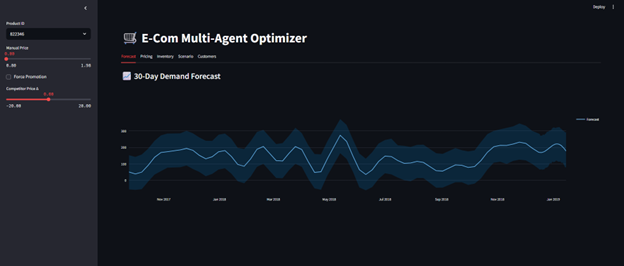
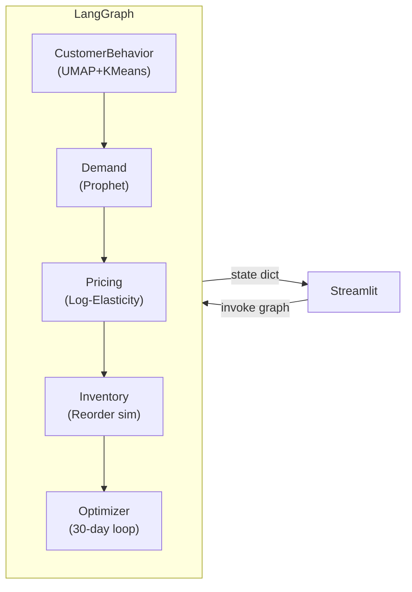

# 🛒 Multi-Agent Retail Optimizer

<div align="center">
  <br>
  <em>30-day demand forecast, optimal price curve, and inventory optimization for a single SKU</em>
</div>

---

## ✨ What’s inside?

| Layer                | File / Folder             | Purpose                                                                                      |
|----------------------|--------------------------|----------------------------------------------------------------------------------------------|
| **Data ETL**         | `dunnhumby_etl.py`        | Converts raw dunnhumby `transaction_data.csv` & `product.csv` to `dh_demand.csv` (weekly demand, price, promo flag, competitor price, stock level). |
| **Agents (LangGraph)** | `multi_agent_graph.py`  | Five interconnected agents:<br>• CustomerBehaviorAgent (UMAP + K-Means)<br>• DemandAgent (Prophet forecast)<br>• PricingAgent (log-log elasticity, revenue maximisation, dynamic price grid)<br>• InventoryAgent (discrete reorder simulation, dynamic reorder point)<br>• *Optimizer* (30-day “what-if” loop)<br>Compiled to a single `graph` object. |
| **Dashboard**        | `dashboard_app.py`        | Streamlit UI: sidebar scenario controls ➜ run graph ➜ render five tabs (Forecast · Pricing · Inventory · Optimizer · Customers). |
| **Synthetic generator** *(optional)* | `generate_synthetic.py` | Creates `synthetic_demand.csv` (1 yr × 10 products) for quick demos.                         |
| **Env**              | `requirements.txt`        | Core libs: `prophet`, `scikit-learn`, `umap-learn`, `langgraph`, `streamlit`, `plotly`, …   |

---

## 🔧 Setup

```bash
# 1. create & activate an env of your choice
conda create -n ecom-optimizer python=3.10 -y
conda activate ecom-optimizer

# 2. install packages
pip install -r requirements.txt

# Prophet note – on some systems you need:
pip install --upgrade cmdstanpy
```

### 📥 Get the data

Download dunnhumby “The Complete Journey” data set  
([source](https://www.dunnhumby.com/source-files/))  
→ `transaction_data.csv`, `product.csv`

Place both CSVs in the repo root.

Run the ETL:

```bash
python dunnhumby_etl.py          # → writes dh_demand.csv
```

*(If you only want to play, run `generate_synthetic.py` instead and point the loader at `synthetic_demand.csv`.)*

**Note:** By default, the dashboard and agents use `dh_demand.csv`. To use `synthetic_demand.csv`, change the relevant file paths in the code (e.g., in `multi_agent_graph.py` and `dashboard_app.py`).

---

## ▶️ Run the optimizer

```bash
streamlit run dashboard_app.py
```

## 🏗️ Architecture



- State is threaded through the graph as a Python dict; each node reads/writes its own keys.
- Caching (`@lru_cache`) avoids refitting Prophet for the same SKU during fast slider moves.

---

## 🗺️ Roadmap ideas

- Plug in Bayesian bandits (Thompson Sampling / UCB) for adaptive pricing.
- Track service-level KPIs (fill-rate, stock-out %, lost sales) inside the optimizer loop.
- Swap Prophet for an LSTM / XGBoost time-series model.
- Persist results to a Redis channel and stream live to the dashboard. *(Redis is listed in requirements for future features, but is not yet used in the current code.)*

---

## 📜 License

MIT – feel free to fork, tweak, and share.

---
