# 🛒 Multi-Agent Retail Optimizer

<div align="center">
  <br>
  <em>30-day demand forecast, optimal price curve, and inventory optimization for a single SKU</em>
</div>

---

## ✨  What’s inside?

| Layer | File / folder | Purpose |
|-------|---------------|---------|
| **Data ETL** | `dunnhumby_etl.py` | Turns dunnhumby **transaction** & **product** CSVs into `dh_demand.csv` (weekly demand, price, promo flag, competitor price & on-hand stock). |
| **Agents**  | `graphs/` <br/>├─ `customer.py` (UMAP + K-Means)<br/>├─ `forecast.py` (Prophet)<br/>├─ `pricing.py` (Log-elasticity + optional Thompson-Sampling)<br/>├─ `inventory.py` (Re-order sim)<br/>└─ `scenario.py` (30-day optimiser loop) | Each file is a self-contained agent. `retail_graph.py` wires them into a LangGraph DAG that passes a shared **state dict** from node → node. |
| **Dashboard** | `dashboard_app.py` | Streamlit dark-theme UI with five tabs: **Forecast · Pricing · Inventory · Optimizer · Customers**. Sidebar sliders let you override price, force promos or tweak competitor price and see the impact instantly. |
| **Evaluation** | `evaluate_prophet.py` | Quick hold-out evaluation (MAE / RMSE / MAPE) for Prophet vs naïve baselines & variant tweaks. |
| **Synthetic demo** *(optional)* | `generate_synthetic.py` | Creates `synthetic_demand.csv` (10 SKUs × 365 days) so you can try the tool without downloading dunnhumby. |
| **Env** | `requirements.txt` | Core libs: `prophet`, `scikit-learn`, `umap-learn`, `langgraph`, `streamlit`, `plotly`, … |

---
## 🔧 Setup

```bash
# 1. create & activate an env of your choice
conda create -n ecom-optimizer python=3.10 -y
conda activate ecom-optimizer

# 2. install packages
pip install -r requirements.txt

# Prophet note – on some systems you need:
pip install --upgrade cmdstanpy
```

### 📥 Get the data

Download dunnhumby “The Complete Journey” data set  
([source](https://www.dunnhumby.com/source-files/))  
→ `transaction_data.csv`, `product.csv`

Place both CSVs in the repo root.

Run the ETL:

```bash
python dunnhumby_etl.py          # → writes dh_demand.csv
```

*(If you only want to play, run `generate_synthetic.py` instead and point the loader at `synthetic_demand.csv`.)*

**Note:** By default, the dashboard and agents use `dh_demand.csv`. To use `synthetic_demand.csv`, change the relevant file paths in the code (e.g., in `multi_agent_graph.py` and `dashboard_app.py`).

---

## ▶️ Run the optimizer

```bash
streamlit run dashboard_app.py
```

## 🏗️ Architecture

```mermaid
flowchart LR
    subgraph LangGraph
        A["CustomerBehaviour<br/>(UMAP + K-Means)"]
        B["Demand<br/>(Prophet)"]
        C["Pricing<br/>(Log elasticity ± Bandit)"]
        D["Inventory<br/>(s,S sim)"]
        E["Optimizer<br/>(30-day loop)"]
        A --> B --> C --> D --> E
    end
    Streamlit -->|invoke graph| LangGraph
    LangGraph -->|state dict| Streamlit
```



- State is threaded through the graph as a Python dict; each node reads/writes its own keys.
- Caching (`@lru_cache`) avoids refitting Prophet for the same SKU during fast slider moves.

---

## 🗺️ Roadmap ideas

- Track service-level KPIs (fill-rate, stock-out %, lost sales) inside the optimizer loop.
- Swap Prophet for an LSTM / XGBoost time-series model.
- Persist results to a Redis channel and stream live to the dashboard. *(Redis is listed in requirements for future features, but is not yet used in the current code.)*

---

## 📜 License

MIT – feel free to fork, tweak, and share.

---
